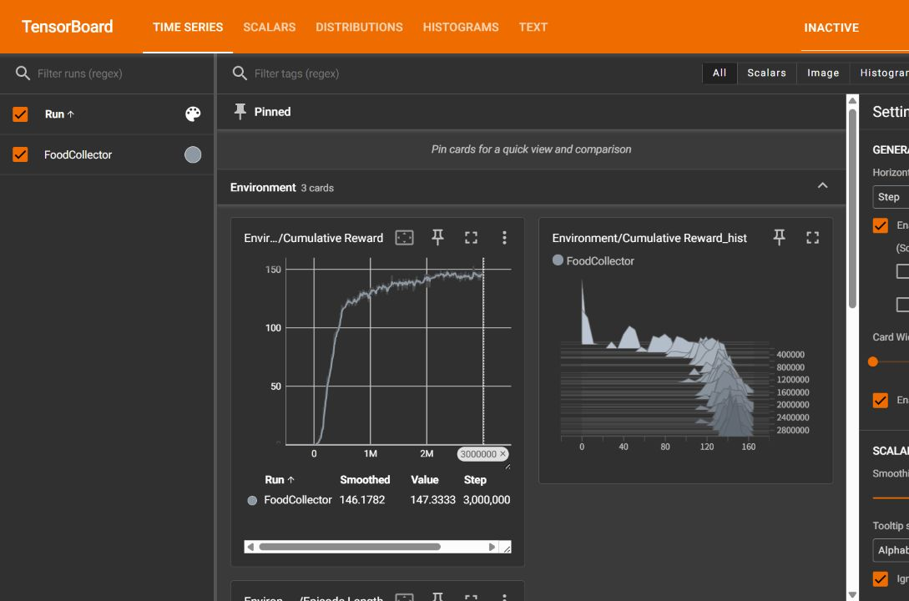
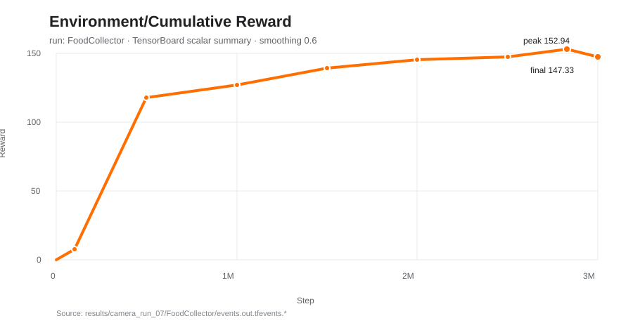

# Week 3 FoodCollector 학습 결과 — `camera_run_07`

32×32 RGB 카메라 관측을 사용하는 FoodCollector 에이전트를 PPO로 300만 step
학습한 최종 실행이다. 이 문서의 수치는 실행 시 생성된 `configuration.yaml`,
`run_logs/timers.json`, `run_logs/training_status.json`, TensorBoard 이벤트 파일을
기준으로 정리했다.

## 핵심 결과

| 항목 | 값 |
|---|---:|
| 최종 체크포인트 | 3,000,456 steps |
| 마지막 TensorBoard 요약 step | 3,000,000 |
| 학습 시간 | 7,898.5초 (2시간 11분 38초) |
| 처리 속도 | 약 380 steps/s |
| 최종 평균 보상 | 147.33 |
| 최종 평균 보상 표준편차 | 3.63 |
| TensorBoard smoothing 0.6 | 146.18 |
| 최고 평균 보상 | 152.94 (2,830,000 steps) |
| 병렬 학습 환경 | TrainingArea 9개 (공유 정책) |
| 에피소드 최대 길이 | 999 steps |

## TensorBoard 보상 곡선



위 이미지는 이 실행의 실제 TensorBoard 화면이다. `Environment/Cumulative Reward`
원본 스칼라를 0.6 smoothing으로 확인했다.
학습 초기에 빠르게 상승한 뒤 200만 step 이후 약 145~150 범위에서 수렴한다.
최종 표시값은 원본 147.3333, smoothing 적용값 146.1782다.

아래 SVG는 보고서에서 확대해 보기 좋은 동일 원본 스칼라의 요약 그래프다.



| Step | 평균 보상 |
|---:|---:|
| 100,000 | 7.90 |
| 500,000 | 118.06 |
| 1,000,000 | 126.85 |
| 1,500,000 | 139.00 |
| 2,000,000 | 145.44 |
| 2,500,000 | 147.56 |
| 2,830,000 | **152.94** |
| 3,000,000 | 147.33 |

다시 확인하려면 저장소 루트에서 다음을 실행한다.

```bash
tensorboard --logdir results/camera_run_07
```

## 학습 환경

| 항목 | 설정 |
|---|---|
| 환경 | Unity FoodCollector, TrainingArea 9개 |
| 관측 | 32×32 RGB 카메라 (`vis_encode_type: simple`) |
| 실행 방식 | Unity Editor, `time_scale: 20`, graphics 사용 |
| ML-Agents | 1.2.0.dev0 |
| PyTorch | 2.2.2+cu121 |
| Python | 3.10.12 |

실행 명령:

```bash
mlagents-learn week3/FoodCollector/config/foodCollector.yaml --run-id=camera_run_07 --timeout-wait 300
```

## 하이퍼파라미터

| 구분 | 파라미터 | 값 |
|---|---|---:|
| 알고리즘 | trainer type | PPO |
| PPO | batch size / buffer size | 1,024 / 10,240 |
| PPO | learning rate | 5.0e-4 (linear) |
| PPO | beta | 8.0e-3 (linear) |
| PPO | epsilon | 0.2 (linear) |
| PPO | lambda / epochs | 0.95 / 3 |
| 네트워크 | hidden units / layers | 128 / 2 |
| 네트워크 | observation normalization | false |
| 보상 | extrinsic gamma / strength | 0.99 / 1.0 |
| 수집 | time horizon | 64 |
| 실행 | max steps | 3,000,000 |
| 기록 | summary frequency | 10,000 |
| 저장 | checkpoint interval / retained | 50,000 / 5 |

## 산출물 및 재개

- `FoodCollector.onnx`: 최종 추론 모델
- `FoodCollector/checkpoint.pt`: 동일한 관측·네트워크 설정에서 학습을 재개할 때 사용
- `FoodCollector/events.out.tfevents.*`: TensorBoard 원본 스칼라 로그
- `configuration.yaml`, `run_logs/`: 실제 실행 설정과 시간·체크포인트 메타데이터

학습을 더 진행하려면 `week3/FoodCollector/config/foodCollector.yaml`의
`max_steps`를 증가시킨 후 실행한다.

```bash
mlagents-learn week3/FoodCollector/config/foodCollector.yaml --run-id=camera_run_07 --resume
```

카메라 해상도나 센서 구성을 바꾸면 관측 shape가 달라지므로 이 체크포인트로
재개할 수 없다. 새 run-id로 처음부터 학습해야 한다.
